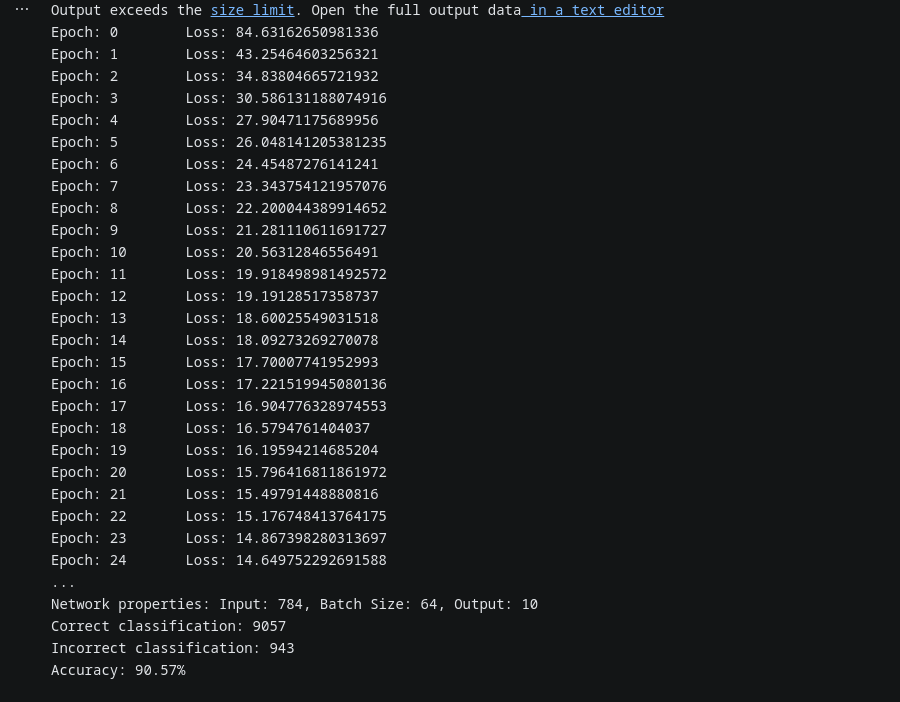

# Backpropagation Algorithm From Scratch

This implementation of the Backpropagation algorithm is made without using any premade ML libraries.

Jupyter Notebook is used to separate runnable portions of code. This helps a ton when I want to test only a small section without having to rerun the entire algorithm.

## Data
Since the data is too large and does not necessarily need to be versioned in Git, the data can be downloaded from kaggle [HERE](https://www.kaggle.com/datasets/oddrationale/mnist-in-csv)
# Topology
Input layer: 784 neurons. ReLU activation function.

Hidden layer: 392 neurons. ReLU activation function.

Output layer: 10 output units. Softmax activation function.

## Final Parameters
30 epochs, 0.0001 learning rate, 64 batch size.

# Results

